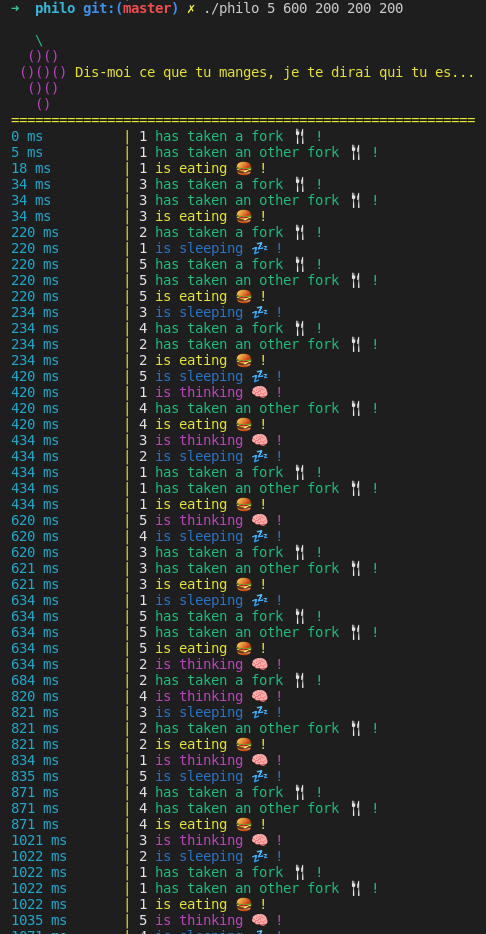

# 42_philosophers

```
" L'art de la philosophie ne vaut que s'il est un art de la guerre. 🤓 " BHL 
```


Le **problème de la table des philosophes** stipule que N philosophes sont assis autour d'une table circulaire avec un grand bol de spaghettis et une fourchette entre chaque paire de philosophes. Chaque philosophe fait l'une des trois choses suivantes : bouffer, ronfler, se branler en pensant. Pendant qu'ils mangent, ils ne pensent pas et ne dorment pas, pendant qu'ils dorment, ils ne mangent pas et ne pensent pas, et bien sûr, pendant qu'ils pensent, ils ne mangent pas et ne dorment pas. De plus, les philosophes ne sont pas conscients du statut des autres philosophes. 

## JE VEUX FAIRE VIVRE MES PHILOS ! COMMENT FAIRE ?!

```
" Le sens de la vie supprimé, il reste encore la vie. 🌱 " Albert Camus
```

```bash
git clone https://github.com/vietdu91/42_philosophers.git
cd philo
bash ./philo [nombre_de_philosophes] [temps_de_mourir] [temps_de_manger] [temps_de_dormir]
```
## IL Y A PLEINS DE TRUCS QUI DEFILENT, JE COMPRENDS QUE DALLE !

```
" L'intelligence est caractérisée par une incompréhension naturelle de la vie 🧬 " Henri Bergson
```
Le but ici est de créer un programme qui simule les 3 états des philosophes et d'imprimer tout changement d'état comme suit :

    timestamp_in_ms X is taking a fork
    timestamp_in_ms X is eating
    timestamp_in_ms X is sleeping
    timestamp_in_ms X is thinking
    timestamp_in_ms X id dead



## ET JE FAIS COMMENT POUR FAIRE VIVRE LES MIENS ?

Pleins de ressources sont à ta disposition, ceux qui m'ont aidé à réaliser ce projet. Il y en a sûrement d'autres, mais je partage celles que j'ai trouvé et qui m'ont servi :

* Le playlist complet du Grand Seigneur CodeVault sur les threads :
    https://www.youtube.com/watch?v=d9s_d28yJq0&list=PLfqABt5AS4FmuQf70psXrsMLEDQXNkLq2&index=1&ab_channel=CodeVault
* Un excellent cours tutoriel universitaire de Livermore sur les notions de thread et le multiprocessing :
    https://hpc.llnl.gov/training/tutorials/introduction-parallel-computing-tutorial + 
    https://hpc-tutorials.llnl.gov/posix/
* Un petit tuto assez sympa et initiatique sur l'ensemble du probleme :
    https://docs.oracle.com/cd/E19205-01/820-0619/geosb/index.html
* Un tutoriel bien foutu, bien francais, qui initie aussi bien sur la maniere de creer les threas et les mutex : 
    https://franckh.developpez.com/tutoriels/posix/pthreads/
  
    
